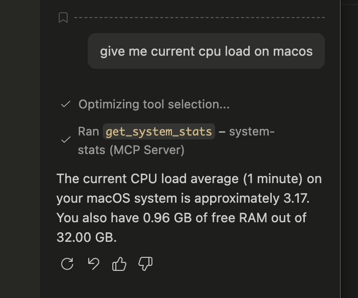

# MCP System Stats (macOS)

A tiny Model Context Protocol (MCP) server that exposes a single tool for
inspecting basic system health from macOS.



## What it provides

- 1-minute CPU load average
- Free and total RAM (GB)
- MCP stdio transport, ready for Claude Desktop or any MCP client

## Requirements

- macOS
- Node.js 18+ (ESM)
- npm

## Install

```bash
npm install
```

## Run

```bash
node index.js
```

If you want a global command, you can link it locally:

```bash
npm link
mcp-system-stats
```

## Use with Claude Desktop

Add a server entry to your Claude Desktop config and restart Claude.

```json
{
  "mcpServers": {
    "system-stats": {
      "command": "/path/to/node",
      "args": ["/absolute/path/to/mcp-system-stats/index.js"]
    }
  }
}
```

## Tool reference

### `get_system_stats`

Returns CPU load and RAM usage.

- Input schema: empty object
- Output: text block

Example response:

```
CPU load (1m): 1.23
Free RAM: 8.12 GB / 16.00 GB
```

## Notes

- The server runs over stdio and stays alive until terminated.
- Metrics come from Node's `os` module.
